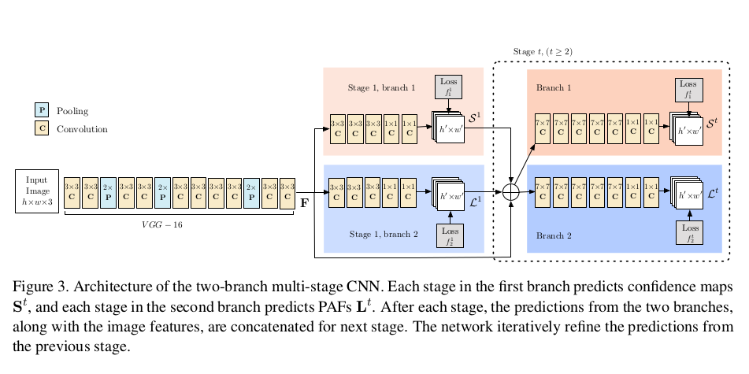
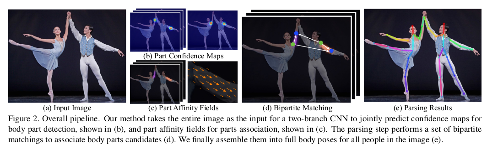
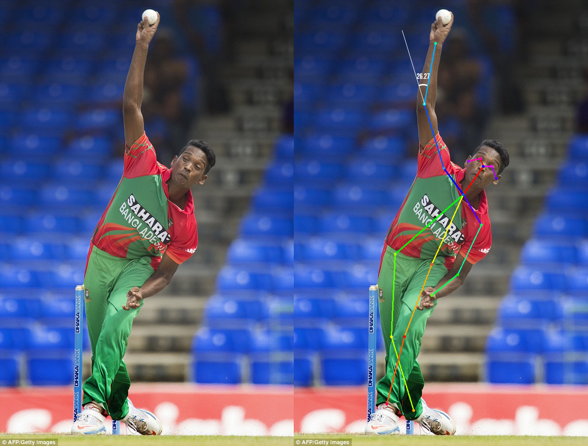

# RT Pose
Human 2D pose estimationthe problem of localizing anatomical key-
points or parts has largely focused on finding body parts of individuals.  
  
  
This project is an implementation of the paper [Realtime Multi-Person Pose Estimation](https://arxiv.org/abs/1611.08050)
  
  
    
  The network is split into two branches: the top branch, shown in beige, pre- dicts the confidence maps, and the bottom branch, shown in blue, predicts the affinity fields. Each branch is an iterative prediction architecture, following Wei et al., which refines the predictions over successive stages, with intermediate supervision at each stage. The image is first analyzed by a convolutional network (initialized by the first 10 layers of VGG-19 and fine- tuned), generating a set of feature maps F that is input to the first stage of each branch. At the first stage, the network produces a set of detection confi- dence maps S and a set of part affinity fields L. In each subsequent stage, the predictions from both branches in the previous stage, along with the original image features F, are concatenated and used to produce refined predictions.
  

  
  
  
  
  
  
